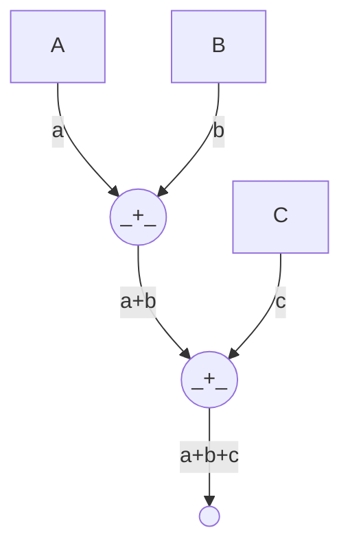

# Arithmetic Circuits

We are all familiar with some sort of circuits, especially if coming from an engineering background:

**Electrical Circuits** are one of the most well known types of circuits:

- _electricity_ flows within the _wires_.
- there are many _components_: battery, switch, diode, ...

**Digital Logic Circuits** are used in computers & digital systems:

- _logic values_ (`0` and `1`) flow within the _wires_.
- logic values do correspond to physical values, e.g. a `0` can be represented by a voltage between 0V-0.8V and a `1` can be represented by a voltage between 2.4V-5V.
- there are _logic gates_: NOT, AND, OR, XOR, NAND, ...

**Arithmetic Circuits** are not much different in terms of the structure, but their usage is much different:

- _numbers_\* flow within the _wires_. (\*: elements of a finite field)
- there are two _gates_: $\boxed{+}$ and $\boxed{\times}$ i.e. addition and multiplication.

## Gates

These gates can take $n$ inputs, in which case we call them $n$-fan-in gates. For example, a $2$-fan-in addition gate takes two numbers and outputs their sum.

For $n>2$ gates, they can be represented by a combination of $2$-fan-in gates. For example, a $3$-fan-in addition gate can be represented by two $2$-fan-in addition gates:

This is why we usually focus on $2$-fan-in gates. In doing so, we get a notion of the "**size**" of the circuit, which is the number of gates in the circuit. The more gates, the larger the circuit & the more expensive it is to compute.

## Numbers

So what exactly are the numbers that are flowing within the wires of our arithmetic circuits? To understand that, we need a bit of group theory background.

[➡️ NEXT SECTION](./2-groups.md)
