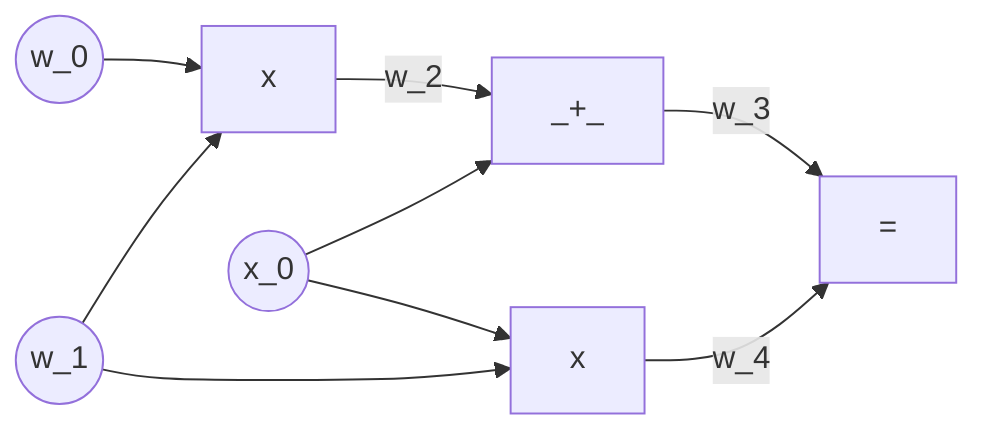
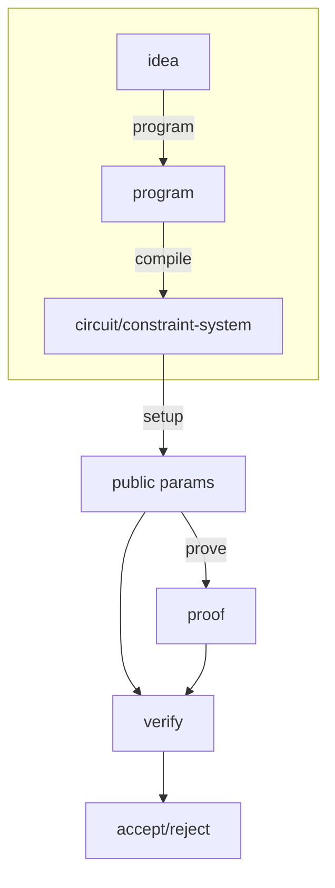

# Arithmetization

All arithmetic circuits are actually polynomials! Here is an example:

```mermaid
flowchart LR
	w0((w_0)) --> m1[x]
	w1((w_1)) --> m1
	w1 --> m2
	x0((x_0)) --> a1
	m1 --w_2--> a1["_+_"]
	x0 --> m2[x]
	a1 --w_3--> eq["="]
	m2 --w_4--> eq["="]
```

## Usage in Zero-Knowledge Cryptography

```mermaid
flowchart TD
	subgraph " "
	idea --program--> p[program]
	p --compile--> c[circuit/constraint-system]
	end
	c --setup--> pp[public params]
	pp --prove--> zkp[proof]
	pp --> verify
	zkp --> verify
	verify --> out[accept/reject]
```
