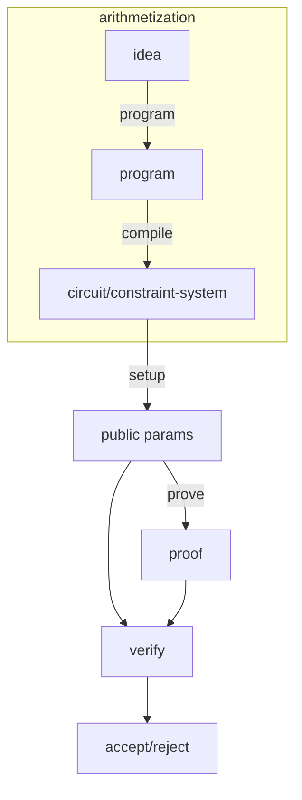

# Usage in Zero Knowledge Cryptography

Now we know the contents of an arithmetic circuits, a question remains: _where do we use them?_ Arithemtic circuit are a great tool to represent a computation; it captures the complexity of a computation in a way that is easy to reason about.

- Boolean circuits can be represented by arithmetic circuits.
- Polynomials can be represented by arithmetic circuits.xw

In Zero-Knowledge Cryptography in particular, we use arithmetic circuits as our model of computation:

- The user has some private inputs $\vec{w}$.
- The user may have some public inputs or public outputs $\vec{x}$.
- A computation is modeled as an arithmetic circuit $C$ that takes in these inputs and optionally produces some outputs.
- All intermediate wires are also considered as private inputs.

Using ZK, the user can prove to the verifier that they have executed the circuit correctly without revealing the private inputs. The verifier can then verify the proof and accept or reject the computation.

Writing circuits by hand is not really easy, so we have quite a lot of tools today, e.g. HDLs (Circom), DSLs (ZoKrates), libraries (Arkworks), etc.

[➡️ NEXT SECTION](./4-r1cs.md)
