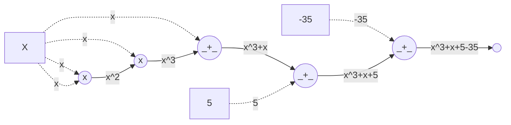

# Rank-1 Constraint System (R1CS)

An arithmetic circuit can be translated into a constraint system. We will go over a famous one called Rank-1 Constraint System (R1CS).

A Rank-1 Constraint System (R1CS) is a set of constraints, where **each constraint** has the form:

$$
\begin{align*}
\sum_{i=1}^{m} a_i \cdot x_i \times \sum_{i=1}^{m} b_i \cdot x_i &= \sum_{i=1}^{m} c_i \cdot x_i
\end{align*}
$$

Some examples:

- $x_2 \times (x_3 - x_2 - 1) = x_1$ is okay.
- $x_2 \times x_2 = x_2$ is okay.
- $x_2 \times x_2 \times x_2 = x_1$ is NOT okay! You can't have two multiplications like that here! So, what can we do? We could capture this operation with the help of an extra variable, let's say $w$:
  - $x_2 \times x_2 = w$ is okay.
  - $x_2 \times w = x_1$ is okay, and these two together capture the equation above.

The R1CS itself is then a set of these constraints. Usually, we consider $n$ constraints for $m$ variables, which is easily represented as a matrix-vector multiplication:

$$
A \cdot x \circ B \cdot x = C \cdot x
$$

where $A, B, C \in \mathbb{F}^{n \times m}$ and $x \in \mathbb{F}^{m}$ and $\circ$ is element-wise multiplication.

## Example: $x^3 + x + 5 = 35$

[Vitalik in his "QAP Zero-to-Hero" article](https://medium.com/@VitalikButerin/quadratic-arithmetic-programs-from-zero-to-hero-f6d558cea649) gives the following computation example:

$$
x^3 + x + 5 = 35
$$

With an arithmetic circuit of this equation, we can prove that we know the solution $x=3$ without telling what $x$ is.

We don't really have an "equals" gate in our circuits, we said we only have addition and multiplication. Well, what we instead do is to rewrite the equation as:

$$
x^3 + x + 5 - 35 = 0
$$

and we will "prove" that when we insert some $x$ the circuit evaluates to 0.

This can be represented as an arithmetic circuit:

Let us write each "gate" and capture their outputs in extra variables $w_i$:

- $w_1 = x \times x$
- $w_2 = x^2 \times x$
- $w_3 = w_2 + x$
- $w_4 = w_3 + 5$
- $w_5 = w_4 - 35$

In R1CS we disallowed more than one multiplication in a single constraint, but with addition we have more freedom, so we can decrease the number of constraints here by combining some of them, and with a slight bit of rearrangement:

- $x \times x = w_1$
- $w_1 \times x = w_2$
- $w_2 + x + 5 = 35$

This is a Rank-1 Constraint System! Let's write this in more clear terms to see exactly how. We have 3 variables in total along with a constant: $\lbrace 1, x, w_1, w_2 \rbrace$, and we have 3 constraints. The resulting matrix-vector multiplication is as follows:

<!-- the new-lines in vectors are important, GitHub markdown viewer needs them -->

$$
\begin{align*}
\begin{bmatrix}
0 & 1 & 0 & 0 \\
0 & 0 & 1 & 0 \\
5 & 1 & 0 & 1
\end{bmatrix} .
\begin{bmatrix}
1 \\
x \\
w_1 \\
w_2
\end{bmatrix} \circ
\begin{bmatrix}
0 & 1 & 0 & 0 \\
0 & 1 & 0 & 0 \\
0 & 0 & 0 & 0
\end{bmatrix} .
\begin{bmatrix}
1 \\
x \\
w_1 \\
w_2
\end{bmatrix} =
\begin{bmatrix}
0 & 0 & 1 & 0 \\
0 & 0 & 0 & 1 \\
35 & 0 & 0 & 0
\end{bmatrix} .
\begin{bmatrix}
1 \\
x \\
w_1 \\
w_2
\end{bmatrix}
\end{align*}
$$

[➡️ NEXT SECTION](./5-qap.md)
