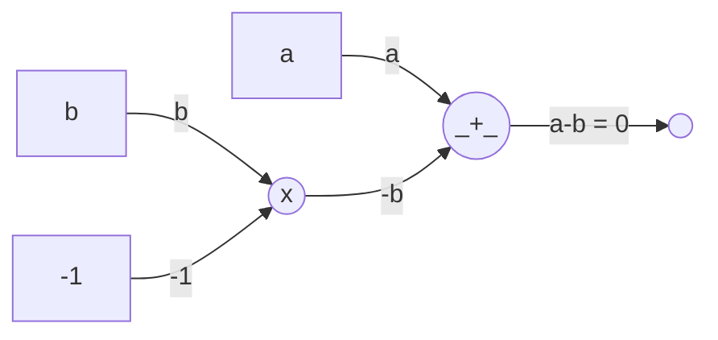
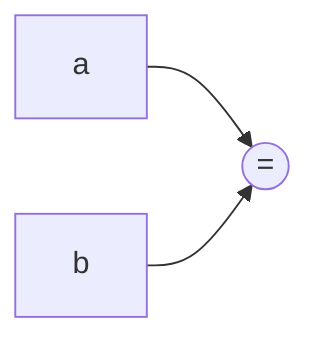

# Designing Circuits

Now that we know what arithmetic circuits are, let's see how we can design them. We don't usually do these by hand these days; instead, a tool does that for us. But it's still important to understand how they work.

## Equality

We don't really have an "equals" gate in our circuits, we said we only have addition and multiplication. Well, what we instead do is to rewrite it:

$$
a = b \iff a - b = 0
$$

While designing a circuit, we will use the shorthand $a = b$ to represent the following circuit:



While designing circuits, we will show this entire thing as:



## Bits & Logic Gates

Boolean circuits are a great way to represent computations. They are made up of logic gates that take in boolean values (`0` and `1`) and output boolean values. Let us consider two inputs $b_0$ and $b_1$.

- **NOT**: $1 - b_0$
- **AND**: $b_0 \times b_1$
- **OR**: $b_0 + b_1 - b_0 \times b_1$
- **XOR**: $b_0 + b_1 - 2 \times b_0 \times b_1$

Note that these are defined over a field, so they will result in some non-sense if the values are not 0 or 1. We need to constrain that as well:

- **BIT**: $b \times b = b$

## Multiplexing

How do we have "control-flow" in circuits, i.e. the thing that corresponds to if-else statements? We can use a multiplexer (MUX) for that. A MUX takes in a control bit and two inputs, and outputs one of the inputs based on the control bit.

Suppose you have two inputs $t$ (for true/1) and $f$ (for false/0), and a control bit $c$. The output $o$ of the multiplexer is given by:

$$
o = f \times (1 - c) + t \times c
$$

Higher multiplexers can be built using these basic ones, grouped together!

## Comparators

Here is when things start to get interesting. Comparators are circuits that compare two numbers and output a boolean value.

### Zero Check

First we need to check if a number is zero. The trick here is to observe that a number is non-zero if it has an inverse, and it is has an inverse then their multiplication should be 1.

We will get help from the Circom code for this:

```cs
template IsZero() {
  signal input in;
  signal output out;

  signal inv <-- in != 0 ? 1 / in : 0;
  out <== 1 - (in * inv);

  in * out === 0;
}
```

Here, `inv` is a signal that we introduce from outside the circuit (also called a **hint**), but it is constrained in some way. Let us look at our constraints, for input $i$ and output $o$, with inverse shown as $i^{-1}$:

// TODO: !!!

### Equality Check

### Less Than Check & Friends

## Arrays

For the last part, we will take a little tour over managing arrays in circuits. An array simply stands for a collection of inputs, but the important thing is that the length of the array is fixed & must be known at the time of creating the circuit!
