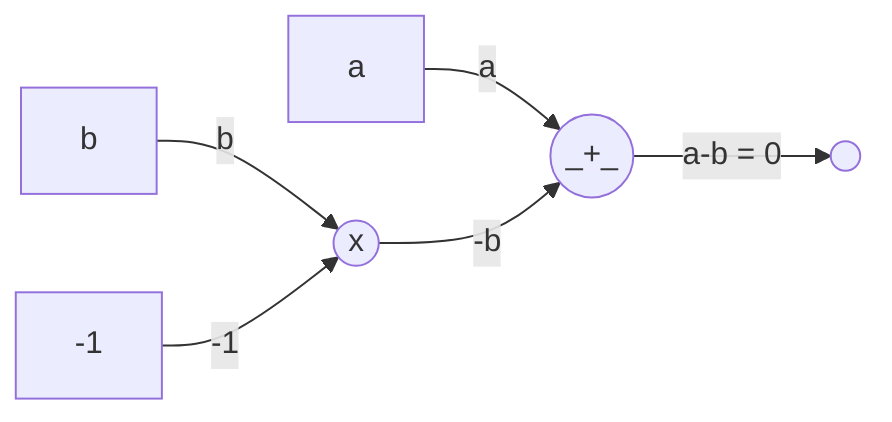
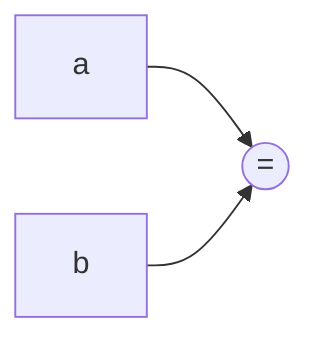
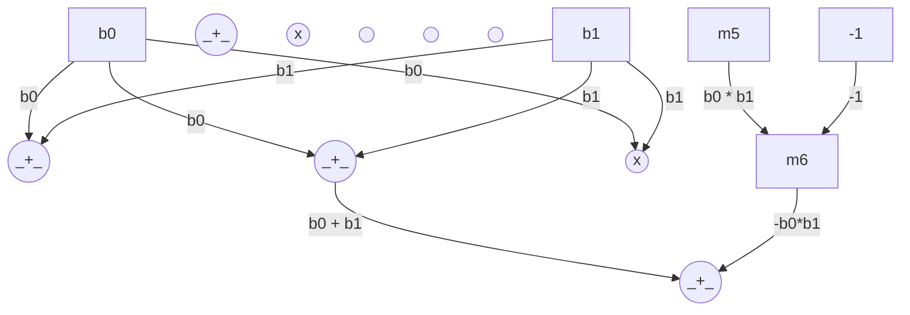

# Designing Circuits

Now that we know what arithmetic circuits are, let's see how we can design them. We don't usually do these by hand these days; instead, a tool does that for us. But it's still important to understand how they work.

## Equality

We don't really have an "equals" gate in our circuits, we said we only have addition and multiplication. Well, what we instead do is to rewrite it:

$$
a = b \iff a - b = 0
$$

While designing a circuit, we will use the shorthand $a = b$ to represent the following circuit:

While designing circuits, we will show this entire thing as:

## Bits & Logic Gates

Boolean circuits are a great way to represent computations. They are made up of logic gates that take in boolean values (`0` and `1`) and output boolean values. Let us consider two inputs $b_0$ and $b_1$.

- **NOT**: $1 - b_0$
- **AND**: $b_0 \times b_1$
- **OR**: $b_0 + b_1 - b_0 \times b_1$
- **XOR**: $b_0 + b_1 - 2 \times b_0 \times b_1$

Note that these are defined over a field, so they will result in some non-sense if the values are not 0 or 1. We need to constrain that as well:

- **BIT**: $b \times b = b$

Let's write the circuit of an **OR** gate as an example:

## Comparators

## Multiplexing

## Arrays
